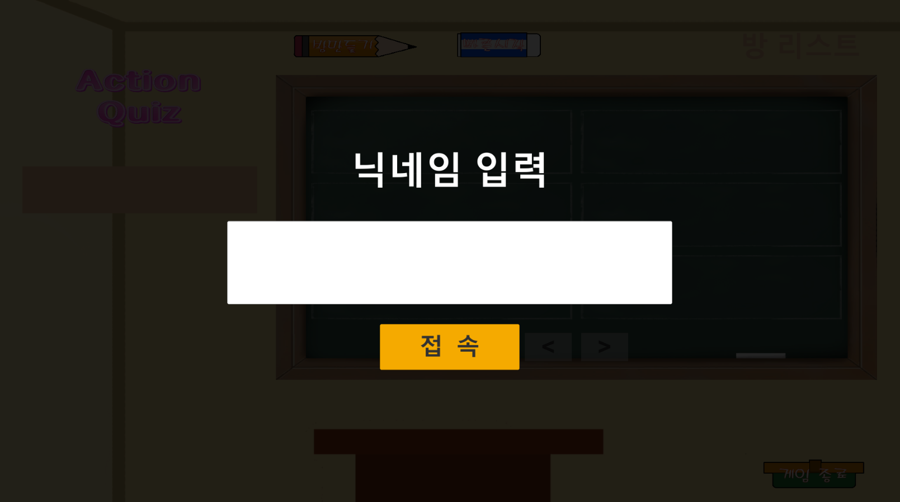
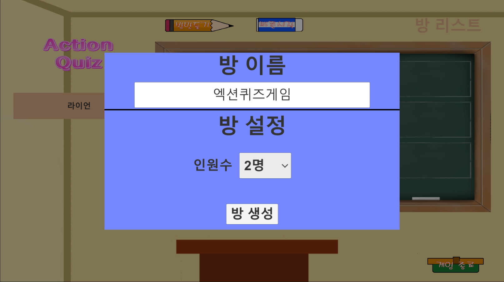
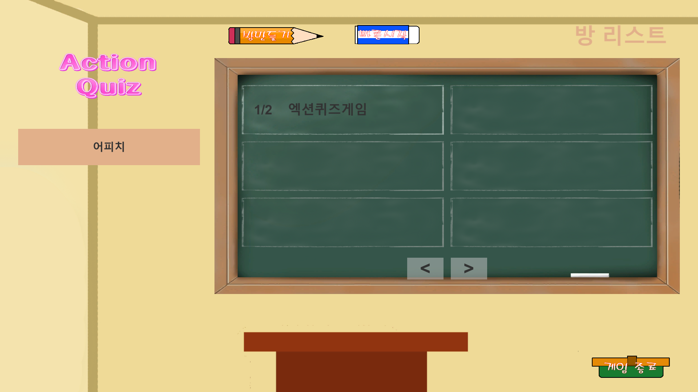
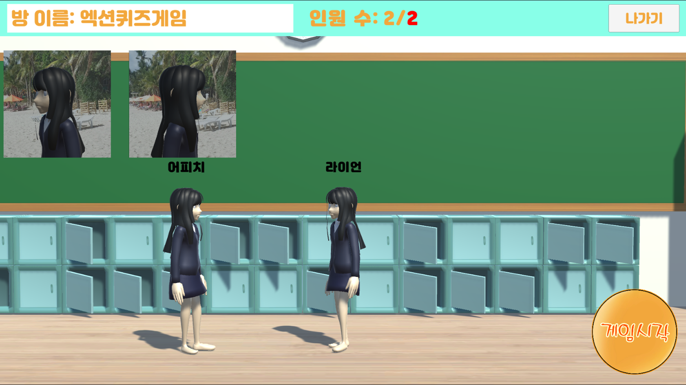
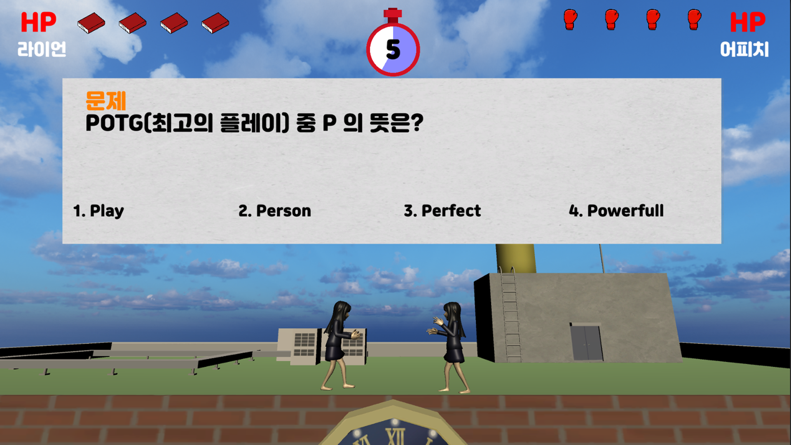
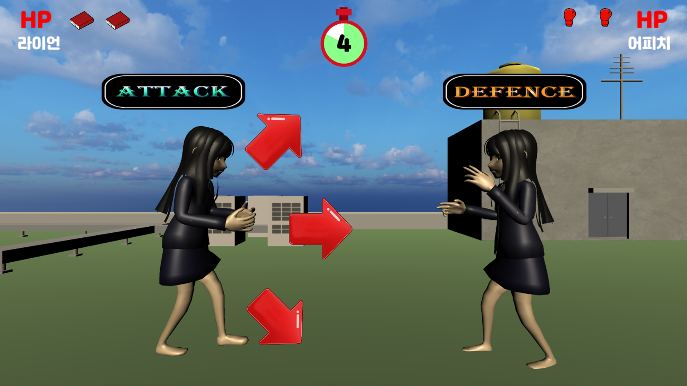
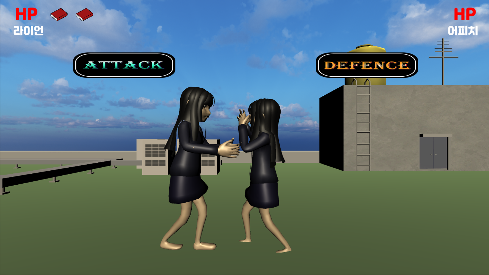
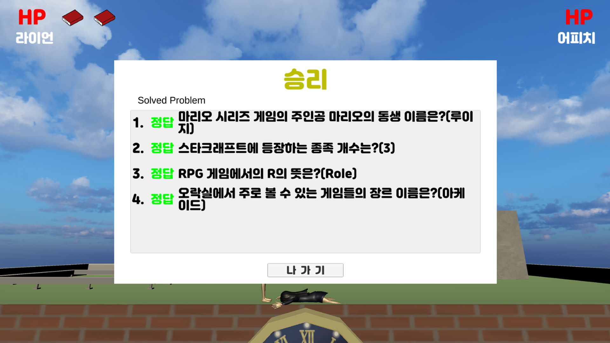

# Action_Quiz_Game

|제목|내용|
|:---:|:---:|
|기간|2022.08.04 ~ 2022.08.05|
|인원|5|
|역할|Photon 서버연동 및 RPC를 통한 로직 구현|
|주제|빠르게 제시된 문제를 푼 후, 공격 및 방어를 하면 Woojer Vest(진동 사운드 조끼)를 통해 진동을 주는 실감나는 퀴즈 게임|
|특이사항|타 대학 학생 동아리와 잠깐 협업했던 내용이기 때문에 미완성 버전|

## 로비
### 닉네임 설정

### 방 생성

### 방 조회

## 대기실

## 플레이
### 문제 제공

### 공격 또는 방어 위치 선정

### 공격 성공&실패 여부에 따른 애니메이션 적용

### 게임 종료 시, 승리&패배 UI 및 문제와 정답 제공

